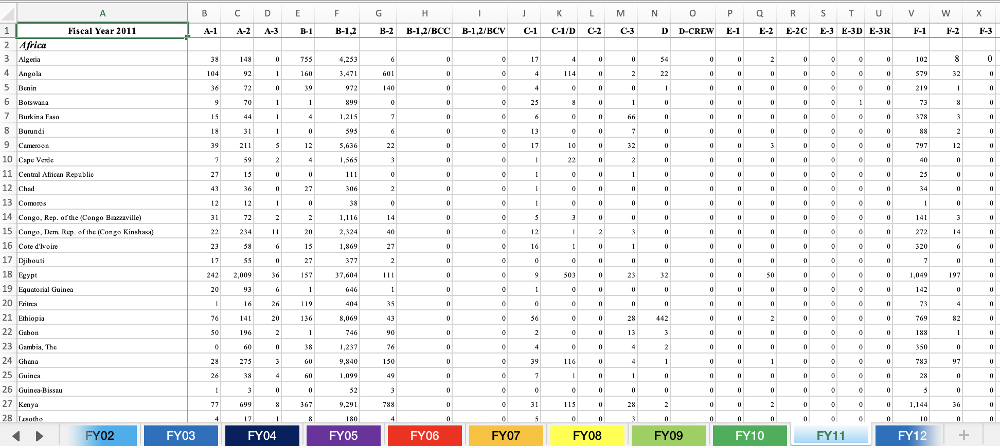
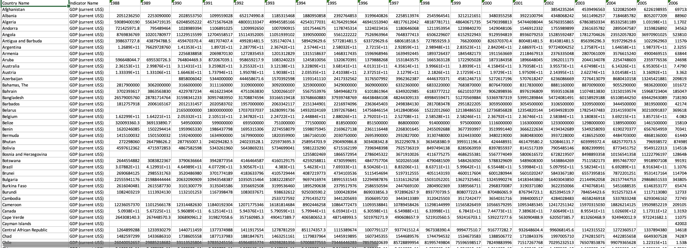

```{r setup, include=FALSE}
knitr::opts_chunk$set(echo = TRUE)
```

# Introduction
This analysis delves into the relationship between a country's GDP and the issuance of F1 (student) and H1B (work) visas over time. By examining data across various countries and continents, we aim to uncover patterns that highlight the influence of economic performance on visa distribution.

# Hypothesis
We hypothesize that higher GDP correlates with an increased number of F1 and H1B visas issued. Conversely, countries experiencing slower economic growth may see fewer visas granted. 

# Dataset Visualization
The visualization below illustrates the issuance of various non-immigrant visas. Our focus will specifically be on the F1 and H1B visa categories.

```{r visa_issuance, echo=FALSE, fig.cap="Non-immigrant Visa Issuance by Type and Country of Origin from 1997-2014", out.width = '100%'}

```

- **X-axis:** Types of Non-immigrant Visas
- **Y-axis:** Continents/Countries of Origin

\
```{r gdp_trends, echo=FALSE, fig.cap="GDP of Countries from 1988-2022 in USD", out.width = '100%'}

```

- **X-axis:** Year
- **Y-axis:** Countries 


# Summary
Today's focus is on cleaning the datasets by removing irrelevant columns and retaining only the relevant variables necessary for analysis. Additionally, we are merging multiple Excel sheets into a single dataset to streamline processing and ensure consistency across data points.


