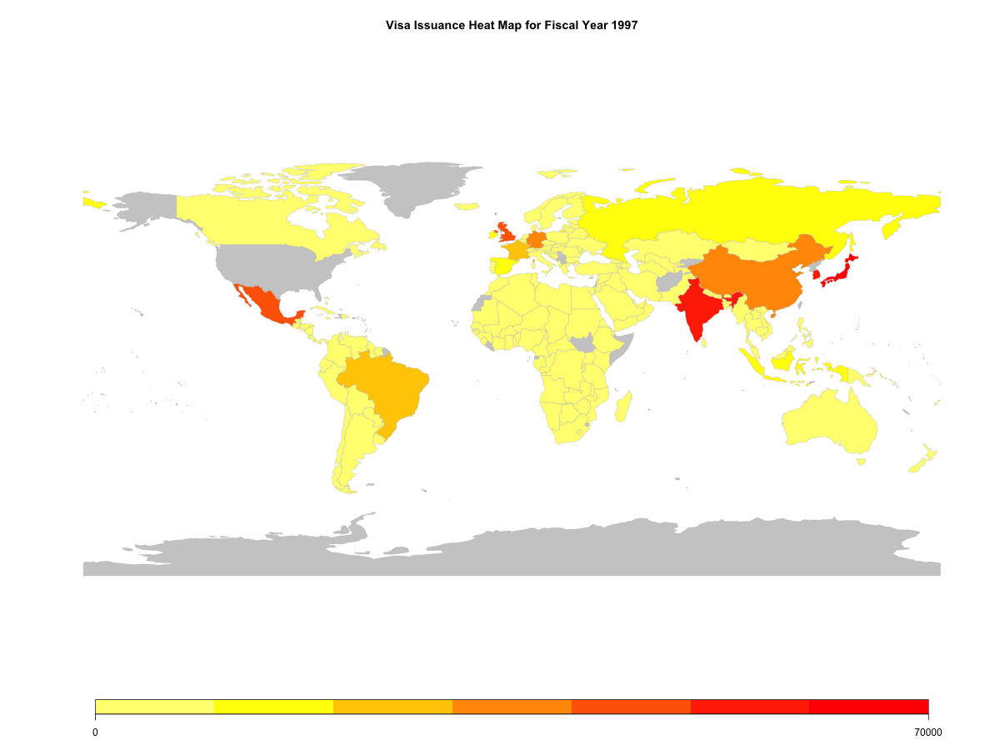

```{r echo=FALSE, warning=FALSE, message=FALSE, results="hide"}
# Load required libraries
library(countrycode)
library(dplyr)
library(ggplot2)
library(leaflet)
library(maps)
library(patchwork)
library(readr)
library(showtext)
library(tidyverse)
library(DT)

# Set the file path
url <- "https://raw.githubusercontent.com/annab0503/DS4002/main/Project%201/Analysis%20Data/analysis_data.csv"

# Read the CSV file from the URL
analysis_data <- read_csv(url)

# Enable the showtext package
showtext_auto()

# Add Google Fonts
font_add_google("Bodoni Moda", "bodoni_moda")  # Alias: bodoni_moda
font_add_google("Montserrat", "montserrat")     # Alias: montserrat
```
```{r eval=FALSE, include=FALSE}
# Step 1: Download and Load the Dataset
url <- "https://github.com/annab0503/DS4002/raw/main/Project%201/Analysis%20Data/analysis_data.csv"
analysis_data <- read.csv(url)

# Step 2: Load Required Packages
packages <- c("ggplot2", "rworldmap", "dplyr", "sp")

install_if_missing <- function(p) {
  if (!requireNamespace(p, quietly = TRUE)) {
    install.packages(p, dependencies = TRUE)
  }
}

lapply(packages, install_if_missing)

library(ggplot2)
library(rworldmap)
library(dplyr)
library(sp)

# Step 3: Load the Dataset from URL
data <- analysis_data

# Step 5: Loop Through Years from 1997 to 2022
for (selected_year in 1997:2022) {

  # Step 6: Filter and Aggregate Visa Data by Country and Year
  visa_data <- data %>%
    filter(`Fiscal.Year` == selected_year) %>%
    group_by(Country) %>%
    summarise(visas_issued = sum(`Quantity.of.U.S..Visas.Granted`, na.rm = TRUE)) %>%
    ungroup()

  if (nrow(visa_data) == 0) {
    message(paste("No data available for the fiscal year", selected_year))
    next
  }

  # Step 7: Map Visa Data to World Map
  world_map <- joinCountryData2Map(
    visa_data,
    joinCode = "NAME",
    nameJoinColumn = "Country"
  )

  if (is.null(world_map)) {
    message("Country matching failed. Check for inconsistencies in country names.")
    next
  }

  # Step 8: Plot the Heat Map
  breaks <- pretty(visa_data$visas_issued, n = 6)

  # Ensure unique breaks for the plot
  if (length(unique(breaks)) < 2) {
    breaks <- unique(c(breaks, max(breaks) + 1))
  }

  mapCountryData(
    world_map,
    nameColumnToPlot = "visas_issued",
    catMethod = breaks,
    mapTitle = paste("Visa Issuance Heat Map for Fiscal Year", selected_year),
    colourPalette = "heat",
    missingCountryCol = gray(0.8),
    addLegend = TRUE
  )
}

png(paste0("visa_heatmap_fy", selected_year, ".png"), width = 1200, height = 900)
  mapCountryData(
    world_map,
    nameColumnToPlot = "visas_issued",
    catMethod = breaks,
    mapTitle = paste("Visa Issuance Heat Map for Fiscal Year", selected_year),
    colourPalette = "heat",
    missingCountryCol = gray(0.8),
    addLegend = TRUE
  )
  dev.off()


```

```{r graph, echo=FALSE, fig.cap="Visa Issuances Heatmap 1997-2022", out.width = '100%'}

```

# **Introduction**

**What drives U.S. visa issuance?** Every year, millions of individuals from around the world apply for U.S. visas. Each application represents a unique story of aspiration, opportunity, and global connection. But behind these personal journeys lies a complex system, shaped by economic realities, shifting policies, and demographic trends. So, what determines who gets to cross U.S. borders?

Among the many U.S. visa categories, three key types most closely tied to economic outcomes are the focus of this analysis:

- **Student and Exchange Visitor Visas**: Fostering human capital development (e.g., F-1 for academic students, J-1 for exchange visitors, and M-1 for vocational students).  
- **Skilled Labor Visas**: Supplying specialized expertise (e.g., H-1B for specialty workers, L-1 for intra-company transferees, and O-1 for extraordinary ability individuals).  
- **Unskilled Labor Visas**: Supporting essential workforce needs (e.g., H-2A for agricultural workers and H-2B for temporary non-agricultural workers).

From a student in India hoping to study in the U.S. to a tech professional in Brazil seeking an H-1B visa, each immigrant’s story reflects the intricate relationship between global economic shifts and U.S. immigration policies. This study explores how economic indicators, government decisions, and labor market needs shape visa issuance trends, asking:

- **How do U.S. policies under different administrations impact visa issuance?**
- **What role do foreign GDP levels play in U.S. visa trends?**
- **How do population growth and migration patterns shape the flow of visa applicants?**

By examining these factors, this analysis seeks to offer insights into how the U.S. adapts its visa strategies in response to domestic and global economic shifts, highlighting the evolving nature of immigration policy.

# **Background**

## Skilled Labor Visas  

The **H-1B visa** is the most prominent skilled labor visa, allowing U.S. employers to hire highly skilled foreign professionals for specialty occupations requiring advanced knowledge and at least a bachelor’s degree or its equivalent. Over the years, the H-1B program has been influenced by economic and political factors. For instance, in 1998, high-tech industry lobbying led to proposals to increase the H-1B visa cap, citing a significant unmet demand for skilled workers. In response, the **American Competitiveness in the 21st Century Act** temporarily raised the cap to 195,000 between 2001 and 2003, before reverting to 65,000 in 2004. The 2008 recession brought further scrutiny, with Congress targeting the program to protect domestic jobs, resulting in a decline in filed petitions. These fluctuations underscore the program’s sensitivity to broader economic conditions and labor market demands.  

## Student and Exchange Visitor Visas

Visas such as the **F-1, J-1,** and **M-1** facilitate international education and cultural exchange in the U.S., playing a key role in human capital development. Policies have evolved over time to ensure better regulation and monitoring of international students. For example, the 1996 **Illegal Immigration Reform and Immigrant Responsibility Act** (IIRIRA) introduced measures to track foreign students, while the 2003 implementation of the **Student and Exchange Visitor Information System** (SEVIS) improved monitoring capabilities. Under the Obama administration, the federal **Optional Practical Training (OPT)** program was expanded for STEM students, reflecting the importance of international talent in innovation and research. However, the Trump administration tightened F-1 visa regulations, proposing fixed-term policies and stricter evaluations, highlighting how political priorities influence visa policies.  

## Unskilled Labor Visas

Unskilled labor visas, including the **H-2A** and **H-2B**, address the demand for temporary agricultural and non-agricultural labor, respectively. The H-2A visa supports agricultural operations during peak seasons, ensuring labor availability for tasks such as planting and harvesting, while the H-2B visa fills gaps in industries like hospitality, construction, and landscaping. These visas are crucial for industries reliant on seasonal or peak-period labor, reflecting the essential role of temporary workers in maintaining economic stability in key sectors.  

## Economic Perspectives on Foreign Workers

Economic discussions about foreign workers revolve around their contributions to growth and innovation as well as concerns about their impact on the domestic labor market. Proponents argue that foreign workers fill critical labor shortages, enhance innovation, and sustain industries with fluctuating labor demands. For example, H-1B visa holders are often associated with technological advancements, patents, and entrepreneurial activities that drive competitiveness. Similarly, unskilled labor visas ensure the stability of sectors like agriculture and tourism, which are vital to the U.S. economy.  

Critics, however, caution against potential wage suppression and increased competition for domestic workers, emphasizing the need for careful policy design to ensure equitable benefits. This research delves into these dynamics, examining how U.S. visa policies reflect broader economic priorities and labor market realities while balancing domestic interests with international interdependence.

# **Methodology**

## Data Sources

Our analysis draws on three primary data sources (originally accessed on January 2, 2025), each providing unique insights into visa trends and the broader economic landscape:

<div class="btn-container"> [U.S. State Department](https://travel.state.gov/content/travel/en/legal/visa-law0/visa-statistics/nonimmigrant-visa-statistics.html){.btn .btn-primary}
</div>

The U.S. State Department's visa statistics offer comprehensive data on nonimmigrant visas issued by the U.S. government, including details on visa types and countries of origin. This dataset can be segmented by visa categories, geographic regions, and other criteria, making it a valuable resource for researchers and policymakers. It is commonly used to analyze trends in U.S. immigration, such as changes in the number of visas issued to foreign nationals over time. Organizations like the U.S. Department of Homeland Security and the Migration Policy Institute (MPI) utilize this data to evaluate the effects of visa policy changes. For example, MPI assesses how shifts in U.S. visa issuance impact international student enrollment trends at U.S. universities.

<div class="btn-container"> [World Bank](https://wits.worldbank.org/CountryProfile/en/country/by-country/startyear/ltst/endyear/ltst/indicator/NY-GDP-MKTP-CD#){.btn .btn-primary} </div>

The World Bank dataset highlights country-level economic indicators, with a focus on Gross Domestic Product (GDP) measured in current US dollars. Through the World Integrated Trade Solution platform, the World Bank provides access to an extensive range of economic, trade, and development data, including GDP figures for all countries. This data is widely used to forecast global economic trends, such as those presented in the World Economic Outlook, which guides the economic policies of member countries. Cross-country GDP comparisons are essential for analyzing global disparities in development. For instance, Dollar and Kraay (2003) used World Bank GDP data to demonstrate a direct correlation between economic growth and poverty reduction in developing nations.

<div class="btn-container"> [U.S. Census Bureau](https://www.census.gov/data-tools/demo/idb/#/table?dashboard_page=country&COUNTRY_YR_ANIM=2025&menu=tableViz&quickReports=CUSTOM&CUSTOM_COLS=POP,GR,RNI,POP_DENS,CBR,CDR,NMR,NIM&TABLE_RANGE=1997,2014&TABLE_YEARS=1997,1998,1999,2000,2001,2002,2003,2004,2005,2006,2007,2008,2009,2010,2011,2012,2013,2014,2025&TABLE_USE_RANGE=Y&TABLE_USE_YEARS=Y&TABLE_STEP=1&TABLE_ADD_YEARS=2025){.btn .btn-primary} </div>

The U.S. Census Bureau's International Data Base (IDB) provides demographic information for countries worldwide, including population size, growth rates, fertility and mortality rates, life expectancy, and migration patterns. Covering multiple decades and regularly updated, the IDB is a key resource for analyzing global population trends and forecasting demographic shifts. Researchers use it to examine population growth and its implications for urbanization, labor markets, and social services, offering insights into the challenges faced by countries with rapidly growing populations.

## Data Cleaning and Integration

To ensure accuracy and compatibility, we executed a rigorous data-cleaning process in Python using a Jupyter Notebook. This process involved:

- **Standardizing Variables**: Key variables such as country names were standardized across datasets to ensure consistency.
- **Handling Missing Data**: Missing values were identified and treated based on the nature of the variable, employing methods such as imputation or exclusion where appropriate.
- **Merging Datasets**: The cleaned datasets were integrated into a unified dataframe using shared keys like country and fiscal year, allowing for seamless analysis across multiple dimensions.
- **Validation**: Cross-referencing with original sources ensured the accuracy of merged data and derived variables.

Detailed replication documents, including the Python code used for cleaning and merging, are available in our [GitHub repository](https://github.com/annab0503/DS4002/blob/main/Project%201/Analysis%20Data/replication_document.ipynb).

## Variables for Analysis

Our cleaned dataset includes the following variables, each essential for addressing our research questions:

| Variable                       | Description                                                                             | Source                |
|--------------------------------|-----------------------------------------------------------------------------------------|-----------------------|
| Country                        | geographic entity of interest                                                           | All                   |
| Fiscal Year                    | year for which data is reported, based on the U.S. fiscal calendar                      | All                   |
| Visa Category                  | classification of U.S. visas issued (e.g., unskilled labor, skilled labor, student)     | U.S. State Department |
| Quantity of U.S. Visas Granted | total number of visas issued for a given type and year                                  | U.S. State Department |
| Population                     | quantity of people living in a given geographic area                                    | U.S. Census Bureau    |
| GDP                            | Gross Domestic Product measured in current U.S. dollars                                 | U.S. Census Bureau    |
| Annual Growth Rate             | annual percent change in population, accounting for natural increase and net migration  | World Bank            |
| Rate of Natural Increase       | percent difference between the crude birth rate and the crude death rate                | U.S. Census Bureau    |
| Population Density             | total population of a geographic area divided by its land area in square kilometers     | U.S. Census Bureau    |
| Crude Birth Rate               | avg. annual number of births during a year per 1,000 population at midyear              | U.S. Census Bureau    |
| Net International Migrants     | number of immigrants minus the number of emigrants, including citizens and non-citizens | U.S. Census Bureau    |

## Analytical Approach

To analyze the data, we employed a visualization-driven methodology to explore trends, patterns, and relationships. Visualization techniques, such as interactive maps, bar charts, and scatterplots, provided intuitive insights into how U.S. visa issuance aligns with economic and demographic indicators.

By leveraging data visualization, we identified trends and formulated hypotheses. This approach enabled us to present complex data in an accessible manner, uncovering insights into how economic indicators and policy shifts shape U.S. visa issuance strategies.

# **Exploratory Analysis**

Anna's section

```{r fig.width=12, fig.height=6, echo=FALSE, warning=FALSE}
# Define key transition years in U.S. presidential administrations
key_events <- c(2001, 2008, 2015, 2020)  # Adjust these as per your dataset

# Aggregate data by Fiscal Year and Visa Category
# The 'Quantity of U.S. Visas Granted' is summed and converted to thousands for clarity
aggregated_data <- analysis_data %>% 
  group_by(`Fiscal Year`, `Visa Category`) %>%  # Group the data by fiscal year and visa category
  summarise(Total_Visas = sum(`Quantity of U.S. Visas Granted`) / 1000, .groups = 'drop')  # Sum the visa quantities and convert to thousands

# Custom color scheme for the different visa categories
visa_colors <- c( 
  "Skilled Labor Visas" = "#F84947",  # Red for skilled labor visas
  "Unskilled Labor Visas" = "#F1C40F",  # Golden yellow for unskilled labor visas
  "Student and Exchange Visitor Visas" = "#5794D4"  # Blue for student and exchange visitor visas
)

# Create the stacked area chart, using the aggregated data and applying visual customization
ggplot(aggregated_data, aes(x = `Fiscal Year`, y = Total_Visas, fill = `Visa Category`)) + 
  geom_area() +  # Generate the stacked area chart to visualize the total visas over time
  geom_vline(xintercept = key_events, linetype = "dashed", color = "gray") +  # Add vertical dashed lines at key event years
  scale_fill_manual(values = visa_colors) +  # Apply the custom color scheme for visa categories
  labs(
    title = "Shifting Borders: The Impact of U.S. Political Events on Visa Issuance Trends",  # Main title of the plot
    x = "Fiscal Year",  # X-axis label
    y = "Total Quantity of Visas (in thousands)",  # Y-axis label
    fill = "Visa Category"  # Label for the legend
  ) + 
  theme_minimal() +  # Apply a minimal theme for a clean, simple appearance
  theme(
    # Customize the primary title
    plot.title = element_text(hjust = 0.5, family = "bodoni_moda", size = 16, margin = margin(b = 15), face = "bold"),  
    # The title is centered (hjust = 0.5), set to Bodoni Moda font with size 16, and a margin at the bottom for spacing
    
    # Customize the legend title
    legend.title = element_text(family = "bodoni_moda", size = 13, face = "bold"),  # Set the legend title font to Bodoni Moda with size 13
    
    # Customize the axis labels and axis text
    axis.title = element_text(family = "montserrat", size = 14),  # Set axis titles (x and y) to use Montserrat font with size 14
    axis.text = element_text(family = "montserrat", size = 12),  # Set axis text (the numbers) to use Montserrat font with size 12
    
    # Apply Montserrat font for all other text elements in the plot
    text = element_text(size = 12, family = "montserrat"),  # Set the default font for text elements to Montserrat with size 12
    
    # Position the legend on the right side of the plot
    legend.position = "right",  # Position the legend to the right
    
    # Align the legend title to the center
    legend.title.align = 0.5  # Center the legend title text
  ) + 
  # Add labels for key events, positioning the labels at the top of the plot
  annotate("text", x = key_events, y = Inf, label = c("9/11 Attack", "Great Recession", "Rep. Control of Congress", "COVID Pandemic"), 
           angle = 90, vjust = 1.5, hjust = 1, color = "black", size = 3, family = "bontserrat")  # Annotate the key events with rotated text
```

## How do U.S. policies under different administrations influence visa issuance trends?

```{r fig.width=12, fig.height=6, echo=FALSE, warning=FALSE}
# Define presidential administration transition years
transition_years <- c(2001, 2009, 2017, 2021)  # Years of presidential transitions

# Aggregate data by Fiscal Year and Visa Category
# The 'Quantity of U.S. Visas Granted' is summed and converted to thousands for clarity
aggregated_data <- analysis_data %>% 
  group_by(`Fiscal Year`, `Visa Category`) %>%  # Group the data by fiscal year and visa category
  summarise(Total_Visas = sum(`Quantity of U.S. Visas Granted`) / 1000, .groups = 'drop')  # Sum the visa quantities and convert to thousands

# Custom color scheme for the different visa categories
visa_colors <- c(
  "Skilled Labor Visas" = "#F84947",  # Red for Skilled Labor Visas
  "Unskilled Labor Visas" = "#F1C40F",  # Golden Yellow for Unskilled Labor Visas
  "Student and Exchange Visitor Visas" = "#5794D4"  # Blue for Student and Exchange Visitor Visas
)

# Create the line chart, using the aggregated data and applying visual customization
ggplot(aggregated_data, aes(x = `Fiscal Year`, y = Total_Visas, color = `Visa Category`, group = `Visa Category`)) +
  geom_line(size = 1) +  # Draw the line chart with a line thickness of 1
  geom_vline(xintercept = transition_years, linetype = "dashed", color = "gray") +  # Add vertical dashed lines at the transition years
  scale_color_manual(values = visa_colors) +  # Apply the custom color scheme for visa categories
  labs(
    title = "From Bush to Biden: How Presidential Administrations Impact Types U.S. Visas Issued",  # Main title of the plot
    x = "Fiscal Year",  # X-axis label
    y = "Total Quantity of Visas (in thousands)",  # Y-axis label
    color = "Visa Category"  # Label for the legend
  ) +
  theme_minimal() +  # Apply a minimal theme for a clean, simple appearance
  theme(
    # Customize the primary title
    plot.title = element_text(hjust = 0.5, family = "bodoni_moda", size = 16, margin = margin(b = 15), face = "bold"),  # Title is centered (hjust = 0.5), uses Bodoni Moda font, size 16, and a bottom margin for spacing

    # Customize the legend title
    legend.title = element_text(family = "bodoni_moda", size = 13, face = "bold"),  # Legend title font set to Bodoni Moda, size 13

    # Customize the axis labels and axis text
    axis.title = element_text(family = "montserrat", size = 14),  # Axis titles (x and y) use Montserrat font, size 14
    axis.text = element_text(family = "montserrat", size = 12),  # Axis text (the numbers) use Montserrat font, size 12

    # Apply Montserrat font for all other text elements in the plot
    text = element_text(size = 12, family = "montserrat"),  # Default font for text elements set to Montserrat, size 12

    # Position the legend on the right side of the plot
    legend.position = "right",  # Legend positioned on the right

    # Align the legend title to the center
    legend.title.align = 0.5  # Center-align legend title text
  ) +
  # Add labels for key events, positioning the labels at the top of the plot
  annotate("text", x = transition_years, y = Inf, label = c("Bush", "Obama", "Trump", "Biden"),
           angle = 90, vjust = 1.5, hjust = 1, color = "black", size = 4, family = "montserrat")  # Annotate key events with rotated text in Montserrat font
```

## What is the relationship between foreign GDP levels and U.S. visa issuance?

Rishika's section

```{r, echo=FALSE}
plot_visa_per_capita_vs_gdp <- function(visa_category) {
  # Filter the data for the selected visa category
  df_category <- analysis_data %>%
    filter(`Visa Category` == visa_category)
  
  # Identify the top 5 countries by total visas granted
  top_5_countries <- df_category %>%
    group_by(Country) %>%
    summarise(total_visas = sum(`Quantity of U.S. Visas Granted`, na.rm = TRUE), .groups = "drop") %>%
    top_n(5, total_visas) %>%
    pull(Country)
  
  # Filter for the top 5 countries and calculate Visa per Capita and GDP per Capita
  df_top_5 <- df_category %>%
    filter(Country %in% top_5_countries) %>%
    mutate(
      Visa_per_Capita = `Quantity of U.S. Visas Granted` / `Population`,
      GDP_per_Capita = `GDP` / `Population`
    )
  
  # Create the plot
  plot <- ggplot(df_top_5, aes(x = GDP_per_Capita, y = Visa_per_Capita, color = Country)) +
    geom_point(size = 3) +
    labs(
      title = paste("Visa per Capita vs GDP per Capita for", visa_category),
      x = "GDP per Capita (USD)",
      y = "Visa per Capita",
      color = "Country"
    ) +
    theme_minimal() +
    theme(
      plot.title = element_text(face = "bold", size = 18, hjust = 0.5),
      axis.text.x = element_text(angle = 45, hjust = 1)
    ) +
    scale_color_brewer(palette = "Dark2")
  
  return(plot)
}

# Generate and display the plots for each visa category
plot_visa_per_capita_vs_gdp("Skilled Labor Visas")

```
China, India, and Mexico are clustered in the bottom-left corner, indicating that they issue fewer skilled labor visas and have lower GDP per capita. This suggests that while these countries have large populations and growing economies, they may not rely on foreign skilled labor as much as others. This may be due to their emphasis on domestic workforce development and the availability of skilled professionals within their own economies. In contrast, the UK, positioned in the top-right corner, shows a high GDP per capita and a larger share of skilled labor visas, reflecting its more developed economy and reliance on attracting specialized talent for advanced industries. Japan, although its GDP per capita is high, is positioned in the bottom-right corner, suggesting that it issues fewer skilled labor visas, possibly due to more restrictive immigration policies or a preference for utilizing domestic labor. The data highlights important trends in how economies at different stages of development approach skilled labor immigration, with developed economies tending to rely more on foreign talent to support high-tech and specialized industries.

```{r, echo=FALSE}
plot_visa_per_capita_vs_gdp("Unskilled Labor Visas")
```
Jamaica is positioned in a line on the left, suggesting that while it has low GDP per capita, it consistently issues a small but steady number of unskilled labor visas. South Africa and Guatemala, placed in the bottom-left area, show lower GDP per capita and similarly limited issuance of unskilled labor visas. Mexico, slightly higher and to the right of South Africa and Guatemala, shows a higher GDP per capita and a moderate issuance of unskilled labor visas, which may reflect a greater level of migration to neighboring countries for low-wage jobs. The UK is placed on the far-right side of the line, indicating that while its GDP per capita is high, it issues unskilled labor visas at a lower level, possibly due to issuance of skilled visas as shown in the previous visualization.


```{r, echo=FALSE}
plot_visa_per_capita_vs_gdp("Student and Exchange Visitor Visas")
```
China and India, with their large populations and growing middle class, send large numbers of students abroad despite their relatively lower GDP per capita. This reflects the increasing demand for higher education and global opportunities. South Korea shows a varied pattern, with a significant number of students leaving for education, which may be attributed to a highly educated population and a strong focus on international exposure. Germany and Japan, despite having high GDP per capita, still show substantial student visa trends, indicating the international appeal of their education systems. Both countries have well-established research and academic institutions that attract students from around the world.

## How do population growth and migration patterns affect visa issuance?

Ada's section
```{r echo=FALSE, warning=FALSE}
# Aggregate data
pop_growth <- analysis_data %>%
  group_by(Country, `Fiscal Year`) %>%
  summarise(Population = sum(Population, na.rm = TRUE), .groups = 'drop')

visa_distribution <- analysis_data %>%
  group_by(Country, `Fiscal Year`, `Visa Category`) %>%
  summarise(Total.Visas = sum(`Quantity of U.S. Visas Granted`, na.rm = TRUE), .groups = 'drop')

# Identify top 5 countries by total visa issuances
top_countries <- visa_distribution %>%
  group_by(Country) %>%
  summarise(Total.Visas = sum(Total.Visas), .groups = 'drop') %>%
  slice_max(Total.Visas, n = 5) %>%
  pull(Country)

# Filter for top countries
filtered_data <- visa_distribution %>%
  filter(Country %in% top_countries)

# Plot stacked bar chart
p <- ggplot(filtered_data, aes(x = `Fiscal Year`, y = Total.Visas, fill = `Visa Category`)) +
  geom_bar(stat = 'identity', position = 'stack') +
  
  labs(
    title = 'Visa Issuance Trends for Top 5 Countries',
    subtitle = 'Stacked bar plot by visa category over the years',
    x = 'Fiscal Year',
    y = 'Total Visas Issued',
    fill = 'Visa Category'
  ) +
  facet_wrap(~ Country, scales = 'free_y', nrow = 2) +
  scale_fill_brewer(palette = 'Set2') +
  theme_minimal(base_size = 14) +
  theme(
    axis.text.x = element_text(angle = 45, hjust = 1, size = 8),
    axis.text.y = element_text(size = 10),
    strip.text = element_text(size = 10, face = 'bold'),
    plot.title = element_text(hjust = 0.5, size = 18, face = 'bold'),
    plot.subtitle = element_text(hjust = 0.5, size = 12),
    legend.position = 'top',
    legend.title = element_text(size = 13),
    legend.text = element_text(size = 11),
    plot.margin = margin(15, 15, 15, 15),
    aspect.ratio = 1.3  # Increase the height further
  )

print(p)
```

# **Conclusion**


# **Works Cited**

-   <https://www.dol.gov/agencies/whd/immigration/h1b>

-   <https://ccis.ucsd.edu/_files/wp11.pdf>

-   <https://www.migrationpolicy.org/article/h-1b-temporary-skilled-worker-program>

-   <https://timelines.issarice.com/wiki/Timeline_of_student_visa_policy_in_the_United_States>

-   <https://www.thecrimson.com/article/2020/12/11/trump-immigration-higher-education/>

-   <https://www.americanimmigrationcouncil.org/research/h1b-visa-program-fact-sheet>

-   Migration Policy Institute. [Migration Policy Institute Website](https://www.migrationpolicy.org/)

-   Preston, S., & Elo, I. (1995). *Demography: Analysis of Mortality and Fertility Rates*. [DOI: 10.1016/S0304-3932(02)00206-4](https://doi.org/10.1016/S0304-3932(02)00206-4).
