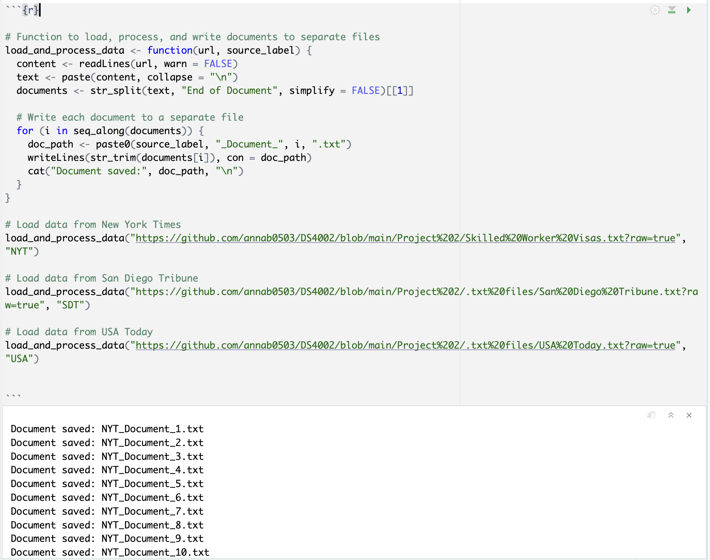

```{r echo=FALSE, warning=FALSE, message=FALSE, results="hide"}
# Function to check and install missing packages 
install_if_missing <- function(packages) { 
  missing_packages <- packages[!packages %in% installed.packages()[, "Package"]] 
  if (length(missing_packages) > 0) { 
    install.packages(missing_packages, dependencies = TRUE) 
  } 
  invisible(lapply(packages, library, character.only = TRUE)) 
} 

# List of required packages 
packages <- c( 
  "countrycode", "dplyr", "DT", "ggplot2", "gridExtra", "leaflet", 
  "maps", "pbapply", "patchwork", "readr", "rworldmap", "showtext", 
  "sp", "stringr", "syuzhet", "tidyverse", "tidytext", "tidyr" 
) 

# Ensure all packages are installed and loaded 
install_if_missing(packages) 
```

```{r message=FALSE, include=FALSE}
# Enable the showtext package
showtext_auto()

# Add Google Fonts
font_add_google("Bodoni Moda", "bodoni_moda")  # Alias: bodoni_moda
font_add_google("Montserrat", "montserrat")     # Alias: montserrat
```

# **Introduction**  

**"Thousands of Indian Women Find Their American Dreams in Jeopardy."** Headlines like this one, from a [2018 *New York Times* article](https://www.nytimes.com/2018/04/06/us/indians-h1b-visas-trump-immigration-wives.html), reflect not only the human stakes of skilled labor visa programs but also the effect of media narratives on public perceptions of immigration. Over time, the portrayal of skilled labor migration in the media has evolved, mirroring changes in political priorities, economic conditions, and societal attitudes. While there are many types of skilled labor and other employment-based visas, the H-1B program specifically offers a valuable lens to explore how media narratives respond to—and influence—policy decisions and public discourse, as it is the most heavily discussed.

[Our previous research](https://rpubs.com/annab0503/1261253) revealed that U.S. visa issuance for skilled workers has steadily increased over time, even amid political and economic fluctuations. This finding raised the following new questions about the role of media in framing public understanding of this trend and its implications:

1. **How has the volume of media coverage on H-1B visas changed over time?** By examining the quantity of articles published over the years, we aim to identify patterns in media attention and how these fluctuations correspond to significant political events, legislative changes, and economic conditions.

2. **How has the sentiment towards H-1B visas in media coverage evolved across presidential administrations?** Understanding shifts in sentiment provides a window into how different administrations’ policies and rhetoric influenced public discourse on skilled labor migration.  
3. **Which topics (as represented by bigrams) are the most consistent and widespread across years?* By investigating the most frequently occurring word pairs (key bigrams) in these articles, this question uncovers dominant themes and recurring narratives, offering deeper insights into the framing of H-1B visa discussions.  

To explore these questions, this study uses three influential outlets — *The New York Times*, *The San Diego Union-Tribune*, and *USA Today* — to examine how media narratives surrounding H-1B visas have evolved from 1997 to 2022. By analyzing trends in coverage, sentiment, and language, we aim go beyond quantitative analysis to explore the nuances of how journalism has both reflected and influenced the broader discourse on skilled labor migration. Through this lens, we seek to understand how media coverage has served as a barometer for societal attitudes and political priorities during pivotal moments in U.S. immigration history.

# **Background**

```{r fig.width=10, fig.height=6, echo=FALSE, warning=FALSE, message=FALSE}

url <- "https://raw.githubusercontent.com/annab0503/DS4002/main/Project%201/Analysis%20Data/analysis_data.csv"

# Read the CSV file from the URL
analysis_data <- read_csv(url)

# Define key transition years in U.S. presidential administrations
transition_years <- c(2001, 2009, 2017, 2021)  # Years of presidential transitions
key_events <- c(2001, 2008, 2015, 2020)  # Key historical events

# Filter out unwanted Visa categories
filtered_data <- analysis_data %>%
  filter(!`Visa Category` %in% c("Unskilled Labor Visas", "Student and Exchange Visitor Visas"))

# Aggregate data by Fiscal Year and Visa Category
# The 'Quantity of U.S. Visas Granted' is summed and converted to thousands for clarity
aggregated_data <- filtered_data %>%
  group_by(`Fiscal Year`, `Visa Category`) %>%
  summarise(Total_Visas = sum(`Quantity of U.S. Visas Granted`) / 1000, .groups = 'drop')  # Sum the visa quantities and convert to thousands

# Custom color scheme for the different visa categories
visa_colors <- c(
  "Skilled Labor Visas" = "#5794D4" 
)

# Create the stacked area chart, using the aggregated data and applying visual customization
ggplot(aggregated_data, aes(x = `Fiscal Year`, y = Total_Visas, fill = `Visa Category`)) + 
  geom_area() +  # Generate the stacked area chart to visualize the total visas over time 
  geom_vline(xintercept = transition_years, linetype = "dashed", color = "gray") +  # Add vertical dashed lines at the transition years
  scale_y_continuous(limits = c(0, 400), breaks = seq(0, 400, 100), labels = scales::comma) +  # Adjust y-axis to show 0 to 400 thousands with custom breaks
  scale_fill_manual(values = visa_colors) +  # Apply the custom color scheme for visa categories
  labs(
    title = "Skilled Labor Visa Issuance is Rising in the United States",  # Main title of the plot
    subtitle = "Total Quantity U.S. Visas Issued to Skilled Laborers and their Dependents, 1997-2022",  # Subtitle of the plot
    x = "Fiscal Year",  # X-axis label
    y = "Total Quantity of Visas Issued (in thousands)"  # Y-axis label
  ) + 
  theme_minimal() +  # Apply a minimal theme for a clean, simple appearance
  theme(
    plot.title = element_text(
        hjust = 0.5, family = "bodoni_moda", size = 18,
        margin = margin(b = 15), face = "bold"
    ),
    plot.subtitle = element_text(
        hjust = 0.5, family = "montserrat", size = 10,
        margin = margin(b = 10)
    ),
    legend.position = "none",  # Remove the legend
    axis.title = element_text(family = "montserrat", size = 14),
    axis.text = element_text(family = "montserrat", size = 12),
    text = element_text(size = 12, family = "montserrat"),
    legend.title.align = 0.5
  ) + 
  # Add labeled points for key events
  geom_point(data = aggregated_data %>% filter(`Fiscal Year` %in% key_events & `Visa Category` == "Skilled Labor Visas"),
             aes(x = `Fiscal Year`, y = Total_Visas), color = "#F84947", size = 3) +  # Make points smaller
  geom_text(data = aggregated_data %>% filter(`Fiscal Year` %in% key_events & `Visa Category` == "Skilled Labor Visas"),
            aes(x = `Fiscal Year`, y = Total_Visas, label = c("9/11 Attack", "Great Recession", "Rep. Control of Congress", "COVID Pandemic")),
            vjust = -1, hjust = 1, color = "black", size = 3, family = "montserrat") +  # Shift labels up
  annotate("text", x = transition_years, y = 400, label = c("Bush", "Obama", "Trump", "Biden"),
           angle = 90, vjust = -0.5, hjust = 1, color = "black", size = 3, family = "montserrat")
```

Created by the [Immigration Act of 1990](https://www.congress.gov/bill/101st-congress/senate-bill/358), the H-1B visa program allows U.S. employers to hire highly skilled foreign professionals for specialty occupations that require advanced knowledge and at least a bachelor’s degree. Visas are awarded to employers on a first-come, first-served basis, with applications accepted each year beginning in April. If the number of applications exceeds an annual cap set by Congress during the first five business days of April, visas are awarded through a lottery system.

As displayed by the area graph above the program’s trajectory has been shaped by a combination of economic forces and political considerations. For instance, lobbying by the high-tech industry in the late 1990s led to a temporary increase in the visa cap, with the American Competitiveness in the 21st Century Act raising the annual limit to 195,000 between 2001 and 2003. However, following the 2008 recession, when protecting domestic jobs became a key legislative priority, the cap reverted to 65,000. These fluctuations underscore the program’s sensitivity to labor market conditions and broader economic trends.

Supporters of the H-1B visa highlight its role in fostering innovation, economic growth, and global competitiveness. H-1B workers are often linked to technological advancements, patents, and entrepreneurial activities that drive critical sectors such as technology, healthcare, and academia. Proponents argue that these workers help address labor shortages in high-demand fields, allowing the U.S. to remain a global leader in innovation.

Conversely, critics raise concerns about potential wage suppression and increased competition for domestic workers. They argue that poorly designed policies could disproportionately benefit corporations, potentially undermining equitable labor market outcomes. These contrasting viewpoints highlight the ongoing debate over balancing the need for international talent with the protection of domestic labor interests.

[One previous study](https://www.pnas.org/doi/10.1073/pnas.2120510119) published by The Proceedings of the National Academy of Sciences (PNAS) used Artificial Intelligence to analyze 200,000 US congressional speeches and 5,000 presidential communications related to immigration over the past 140 years. It identified both a trend toward more positive attitudes since World War II and an increase in political polarization, with Democrats maintaining support and Republicans adopting more hostile rhetoric. While this study offers valuable context on broader immigration discourse, we aim to to provide a more narrowed analysis on the legal immigration of skilled labor through the H-1B visa program, exploring how this issue is framed and debated in political and media narratives. This distinct approach examines the broader economic narratives tied to immigration policy and its impact on innovation.
 
# **Methodology**

## Data Sources  
This project examines news coverage of U.S. work visa programs, specifically skilled labor visas (H-1B), by analyzing articles published between January 1, 1997, and December 31, 2022, in *The New York Times*, *The San Diego Union-Tribune*, and *USA Today*.  

To construct our dataset, we used [Nexis Uni](https://advance-lexis-com.proxy1.library.virginia.edu/bisnexishome?crid=d5c0d340-3f4e-4bc3-b8f7-c2beb8781c56&pdmfid=1519360&pdisurlapi=true) to filter and extract relevant articles. The following parameters were applied to ensure the data set accurately reflects the desired coverage of H-1B visas:

| Parameter       | Description                                                      |
|-----------------|------------------------------------------------------------------|
| Keywords        | "U.S. visa", "H1-B"                                              |
| Source Type     | Newspapers                                                       |
| Source Location | North America, United States                                     |
| Language        | English                                                          |
| Timeline        | January 1, 1997 – December 31, 2022                              |
| Source Names    | *The New York Times*, *The San Diego Union-Tribune*, *USA Today* |

The filtered articles were categorized by news source and saved into text files. These three text files were then read into R, where we were separated into individual documents and categorized by the year they were published for further analysis. 

```{r display-image, echo=FALSE}

# Use knitr to include an external image
#

```

This organization allows us to track trends and sentiment shifts over time, facilitating the examination of the relationship between media coverage, policy changes, and political events.

## Limitations
A key limitation of this methodology is that Nexis Uni lacks an API for automated data extraction, requiring all articles to be manually searched, selected, and downloaded. With over 650 articles across the three data sets, human error could have led to some relevant documents being overlooked or irrelevant ones included. To address this, we carefully defined our search parameters and conducted multiple rounds of manual checks to ensure the dataset was as accurate and relevant as possible. While this process helped minimize errors, the possibility of some inconsistencies remains. Nevertheless, we believe the dataset effectively captures the essential trends in H-1B visa coverage.

Additionally, Lexis Uni imposes a daily download limit and does not include all major U.S. news sources, such as *The Washington Post* and *The Wall Street Journal*. Given these restrictions and the project's time constraints, we were unable to select every available source. To minimize bias, we chose a publication from each coast and a national outlet to ensure a diverse representation of coverage.

# **Exploratory Analysis**
```{r include=FALSE}
# Function to load, process, and write documents to separate files
load_and_process_data <- function(url, source_label) {
  content <- readLines(url, warn = FALSE)
  text <- paste(content, collapse = "\n")
  documents <- str_split(text, "End of Document", simplify = FALSE)[[1]]

  # Write each document to a separate file
  for (i in seq_along(documents)) {
    doc_path <- paste0(source_label, "_Document_", i, ".txt")
    writeLines(str_trim(documents[i]), con = doc_path)
    cat("Document saved:", doc_path, "\n")
  }
}

# Load data from New York Times
load_and_process_data("https://github.com/annab0503/DS4002/blob/main/Project%202/.txt%20files/New%20York%20Times.txt?raw=true", "NYT")

# Load data from San Diego Tribune
load_and_process_data("https://github.com/annab0503/DS4002/blob/main/Project%202/.txt%20files/San%20Diego%20Tribune.txt?raw=true", "SDT")

# Load data from USA Today
load_and_process_data("https://github.com/annab0503/DS4002/blob/main/Project%202/.txt%20files/USA%20Today.txt?raw=true", "USA")
```

```{r include=FALSE}
# Step 2: Load Split Documents
doc_files <- list.files(pattern = "^(NYT_|SDT_|USA_)Document_\\d+\\.txt")

# Read all documents into a list
documents <- lapply(doc_files, readLines)

# Combine each document's content into a single text string
documents <- lapply(documents, paste, collapse = " ")

# Create a data frame for analysis
doc_data <- data.frame(
  Document = doc_files,
  Text = unlist(documents),
  stringsAsFactors = FALSE
)
```

```{r include=FALSE}
# Step 3: Extract Dates from the Text
extract_date <- function(text) {
  date_pattern <- "\\b(January|February|March|April|May|June|July|August|September|October|November|December) \\d{1,2}, \\d{4}\\b"
  date <- str_extract(text, date_pattern)
  if (is.na(date)) {
    cat("Date extraction failed for document:", substr(text, 1, 100), "...\n")
  }
  return(date)
}

# Apply the function to extract dates for all documents
doc_data$Date <- sapply(doc_data$Text, extract_date)
doc_data$Date <- as.Date(doc_data$Date, format = "%B %d, %Y")
doc_data$Year <- format(doc_data$Date, "%Y")

# Display a preview of the dataset
head(doc_data[, c("Document", "Date", "Year")])
```

## How has the volume of media coverage on H-1B visas changed over time?

```{r echo=FALSE, warning=FALSE, message=FALSE}
library(tidyr)

# Presidents list
presidents <- c("Bush", "Obama", "Trump", "Biden")

# Count mentions of each president
count_presidents <- function(text, presidents) {
  sapply(presidents, function(president) {
    str_count(text, president)
  })
}

# Count mentions of each president in the documents
president_counts <- t(sapply(doc_data$Text, count_presidents, presidents = presidents))

# Prepare data
president_data <- as.data.frame(president_counts)
president_data$Year <- doc_data$Year
president_data_long <- pivot_longer(president_data, 
                                    cols = starts_with("Biden"):starts_with("Bush"),
                                    names_to = "President",
                                    values_to = "Mentions")

# Summarize the data by year and president
president_by_year <- president_data_long %>%
  group_by(Year, President) %>%
  summarise(TotalMentions = sum(Mentions, na.rm = TRUE))

# Create the plot with customized aesthetics
ggplot(president_by_year, aes(x = as.numeric(Year), y = TotalMentions, color = President)) +
  geom_line() +
  geom_point() +
  labs(
    title = "Presidents' Mentions Over Time",
    x = "Fiscal Year",
    y = "Total Mentions",
    color = "President"
  ) +
  scale_color_manual(values = c(
    "Bush" = "#A93226",  # Dark Red for Bush
    "Obama" = "#F1C40F",  # Golden yellow for Obama
    "Trump" = "#F84947",  # Red for Trump
    "Biden" = "#5794D4"    # Blue for Biden
  )) +
  theme_minimal() +
  theme(
    # Title customization
    plot.title = element_text(hjust = 0.5, family = "bodoni_moda", size = 16, margin = margin(b = 15), face = "bold"),
    
    # Legend customization
    legend.title = element_text(family = "bodoni_moda", size = 13, face = "bold"),
    legend.position = "right",  # Place legend on the right
    legend.title.align = 0.5,   # Center the legend title
    
    # Axis title and text customization
    axis.title = element_text(family = "montserrat", size = 12),
    axis.text = element_text(family = "montserrat", size = 10),
    
    # General text customization
    text = element_text(size = 12, family = "montserrat")
  )
```

```{r echo=FALSE, warning=FALSE, message=FALSE}
# Count mentions of "H-1B" in each text
doc_data$H1B_Count <- sapply(doc_data$Text, function(text) { 
  str_count(text, "H-1B") 
})

# Summarize the total mentions by year
h1b_by_year <- doc_data %>%
  group_by(Year) %>%
  summarise(TotalH1B = sum(H1B_Count, na.rm = TRUE))

# Create the plot with customized aesthetics
ggplot(h1b_by_year, aes(x = as.numeric(Year), y = TotalH1B)) +
  geom_line(color = "#5794D4") +   
  geom_point(color = "#5794D4") +  
  labs(
    title = "H-1B Usage Over Time",
    x = "Fiscal Year",
    y = "Total H-1B Mentions"
  ) +
  theme_minimal() +
  theme(
    # Title customization
    plot.title = element_text(hjust = 0.5, family = "bodoni_moda", size = 16, margin = margin(b = 15), face = "bold"),
    
    # Axis title and text customization
    axis.title = element_text(family = "montserrat", size = 12),
    axis.text = element_text(family = "montserrat", size = 10),
    
    # General text customization
    text = element_text(size = 12, family = "montserrat")
  )
```
Do we need the H-1B usage over time graph? Given that we selected our documents by filtering for "H-1B" (which we explain in the methodology section), I think it may be somewhat redundant to the overall articles per year graph below. There is no distinct difference in the trend between the two, so I think we should remove one of them (and since the one contains more information than the one above, I think it makes sense to keep the second one.) - Anna

```{r stacked-bar-plot-with-regression-line, echo=FALSE, warning=FALSE, message=FALSE}
# Count articles per year for each source
year_counts <- doc_data %>% 
  group_by(Year, Source = gsub("^(NYT_|SDT_|USA_).*", "\\1", Document)) %>% 
  summarise(ArticleCount = n(), .groups = 'drop')

# Convert 'Source' to a more readable format
year_counts$Source <- gsub("NYT_", "New York Times", year_counts$Source)
year_counts$Source <- gsub("SDT_", "San Diego Tribune", year_counts$Source)
year_counts$Source <- gsub("USA_", "USA Today", year_counts$Source)

# Calculate the total articles per year for the regression analysis
total_articles_per_year <- year_counts %>%
  group_by(Year) %>%
  summarise(TotalArticles = sum(ArticleCount), .groups = 'drop')

# Plot a stacked bar plot with custom aesthetics
ggplot() +
  geom_bar(data = year_counts, aes(x = as.numeric(Year), y = ArticleCount, fill = Source), 
           stat = "identity", position = "stack") +
  geom_text(data = total_articles_per_year, aes(x = as.numeric(Year), y = TotalArticles, 
            label = TotalArticles), vjust = -0.5, color = "black", size = 3) +
  geom_smooth(data = total_articles_per_year, aes(x = as.numeric(Year), y = TotalArticles), 
              method = "lm", color = "#A93226", se = FALSE, size = 1) +
  scale_fill_manual(values = c(
    "New York Times" = "#5794D4",   # Red for New York Times
    "San Diego Tribune" = "#F1C40F",  # Yellow for San Diego Tribune
    "USA Today" = "#F84947"   # Blue for USA Today
  )) +
  labs(
    title = "Article Count per Year from 1997-2022",
    x = "Year",
    y = "Number of Articles",
    fill = "Source"
  ) +
  theme_minimal() +
  theme(
    # Title customization
    plot.title = element_text(hjust = 0.5, family = "bodoni_moda", size = 16, margin = margin(b = 15), face = "bold"),
    
    # Legend customization
    legend.title = element_text(family = "bodoni_moda", size = 13, face = "bold"),
    legend.position = "right",  # Place legend on the right
    legend.title.align = 0.5,   # Center the legend title
    
    # Axis title and text customization
    axis.title = element_text(family = "montserrat", size = 12),
    axis.text = element_text(family = "montserrat", size = 10),
    
    # General text customization
    text = element_text(size = 12, family = "montserrat"),
    
    # Improve x-axis label readability
    axis.text.x = element_text(angle = 45, hjust = 1)
  )
```

## How has the sentiment towards H-1B visas in media coverage evolved across presidential administrations?
To understand how sentiment towards H-1B visas has evolved across presidential administrations, we conducted a comprehensive sentiment analysis of media coverage using two well-established lexicon libraries: the Bing Liu sentiment lexicon and the National Research Council (NRC) Emotion Lexicon. The Bing lexicon categorizes words into positive or negative sentiments, offering a straightforward way to measure the general tone of the coverage. In contrast, the NRC Emotion Lexicon provides a more nuanced perspective by associating words with eight primary emotions (such as joy, anger, and fear) in addition to positive and negative sentiments. By leveraging these tools, we analyzed the sentiment trends over time, capturing both overarching positivity or negativity and the emotional undertones of the media narrative during different presidential administrations. 

```{r echo=FALSE, warning=FALSE, message=FALSE}
# Step 1: Perform Sentiment Analysis
# Calculate sentiment scores for each document
doc_data$Sentiment <- sapply(doc_data$Text, function(text) {
  sentiment <- get_sentiment(text, method = "bing")
  mean(sentiment)  # Average sentiment score for the document
})
```

```{r echo=FALSE, warning=FALSE, message=FALSE}
# Step 2: Group by Year and Analyze
# Group by year and calculate average sentiment per year
sentiment_by_year <- doc_data %>%
  group_by(Year) %>%
  summarise(AverageSentiment = mean(Sentiment, na.rm = TRUE))
```

```{r echo=FALSE, warning=FALSE, message=FALSE}
# Step 3: Multiply Sentiment by the Number of Articles per Year
sentiment_with_articles <- doc_data %>%
  group_by(Year) %>%
  summarise(
    AverageSentiment = mean(Sentiment, na.rm = TRUE),
    TotalArticles = n()
  ) %>%
  mutate(
    AdjustedSentiment = AverageSentiment * TotalArticles  # Multiply sentiment by article count
  )

```

```{r echo=FALSE, warning=FALSE, message=FALSE}
# Step 4: Add labels
# Define key transition years for administrations
admin_years <- c(2001, 2009, 2017, 2021)  # Adjust these years based on administrations
admin_labels <- c("Bush", "Obama", "Trump", "Biden")

# Define key events and labels
key_events <- c(2001, 2007, 2015, 2020)
event_labels <- c("9/11 Attack", "Great Recession", "Rep. Control of Congress", "COVID Pandemic")
```

Beginning with the Bing Library, we calculated an overall annual sentiment score by aggregating the sentiment scores of individual documents for each year. To ensure the results accurately reflected yearly sentiment trends, we accounted for variations in the number of documents per year by weighting each year's aggregated score by the total number of documents analyzed in that year. This approach also helped mitigate the influence of outliers, providing a more reliable measure of the prevailing sentiment in media coverage for each year. 

```{r fig.width=10, fig.height=6, echo=FALSE, warning=FALSE, message=FALSE}
# Step 5: Visualize Adjusted Sentiment Over Time with Presidential Administration Lines
ggplot(sentiment_with_articles, aes(x = Year, y = AdjustedSentiment)) + 
  geom_line(color = "#5794D4") + 
  geom_point(color = "#5794D4") + 
  geom_vline(xintercept = admin_years, linetype = "dashed", color = "gray") +  # Add dashed lines for admin transitions
  annotate("text", x = admin_years, y = Inf, label = admin_labels, angle = 90, vjust = 1.5, hjust = 1, color = "black", size = 3, family = "montserrat") +  # Annotate with admin labels
  geom_hline(yintercept = 0, color = "darkgray", size = 0.5) +  # Add a horizontal line at y=0
  labs(
    title = "Attitudes Are Historically Volatile, But Becoming More Extreme", 
    subtitle = "Average Adjusted Sentiment Score (Bing), 1997-2022",
    x = "Year", 
    y = "Adjusted Sentiment Score"
  ) + 
  theme_minimal() + 
  theme(
    plot.title = element_text(hjust = 0.5, family = "bodoni_moda", size = 16, margin = margin(b = 15), face = "bold"),
    plot.subtitle = element_text(hjust = 0.5, family = "montserrat", size = 12, margin = margin(b = 10)),
    axis.title = element_text(family = "montserrat", size = 14),
    axis.text = element_text(family = "montserrat", size = 10, color = "black"),
    text = element_text(size = 12, family = "montserrat")
  ) +
  # Add red points for key events
  geom_point(data = sentiment_with_articles %>% filter(Year %in% key_events),
             aes(x = Year, y = AdjustedSentiment), color = "#F84947", size = 2) +
  # Add labels for key events
  geom_text(data = sentiment_with_articles %>% filter(Year %in% key_events),
            aes(x = Year, y = AdjustedSentiment, label = event_labels),
            vjust = -1, hjust = 1, color = "black", size = 3, family = "montserrat")
```

This sentiment analysis, as shown in the line graph above, revealed a historic volatility in media coverage surrounding H-1B visas over the past two decades, with sentiment oscillating between positive and negative. These shifts often align with periods of economic uncertainty, where public opinion appears to be influenced by labor market conditions and evolving immigration policies. More notably, the magnitude of these sentiment swings has intensified in the past ten years, which may be a result of the increasing polarization of public discourse on immigration and workforce-related issues. As debates surrounding H-1B visas have become more politically charged, media narratives have mirrored this heightened divisiveness, further amplifying the emotional and ideological intensity of the discourse.

Given this general trend, we further refined our analysis by utilizing the National Research Council (NRC) Emotion Lexicon to examine specific emotional shifts in media coverage across different presidential administrations. To more effectively compare the usage of positive emotions with negative emotions, we assigned negative values to the emotions categorized as negative (such as anger, fear, and sadness). This allowed us to clearly distinguish between positive and negative emotional tones, enabling a more accurate analysis of the emotional dynamics in media discourse surrounding H-1B visas.

```{r echo=FALSE, warning=FALSE, message=FALSE}
# Step 1: Perform Sentiment Analysis with NRC Lexicon and Progress Bar
doc_data$Emotion_Frequency <- pblapply(doc_data$Text, function(text) {
  # Unnest tokens (words) from the text
  words <- tibble(text = text) %>%
    unnest_tokens(word, text)
  
  # Get NRC emotions for the words
  emotions <- get_sentiments("nrc")
  
  # Match words from the document with the NRC emotions
  matched_emotions <- emotions %>%
    filter(word %in% words$word)
  
  # Create a count of each emotion
  emotion_counts <- matched_emotions %>%
    count(sentiment, name = "count")
  
  # Return a data frame with emotions and their counts
  return(emotion_counts)
})

# Step 2: Unnest the Emotion Frequency List
# Unnest the list of emotion frequencies (this will give each emotion's count per document)
doc_data_unnested <- doc_data %>%
  unnest(cols = c(Emotion_Frequency))

# Step 3: Create the Year-to-Administration Mapping
# Adjust this according to your range of years (1997 - 2022)
year_to_admin <- tibble(
  Year = 1997:2022,
  Administration = c(
    rep("Clinton", 4),
    rep("Bush", 8),
    rep("Obama", 8),
    rep("Trump", 4),
    rep("Biden", 2)
  )
)

# Step 4: Merge the year-to-administration mapping with the existing data
# Convert Year to integer in doc_data_unnested before joining
doc_data_unnested_with_admin <- doc_data_unnested %>%
  mutate(Year = as.integer(Year)) %>%  # Convert Year to integer
  left_join(year_to_admin, by = "Year")  # Perform the join

# Step 5: Adjust Negative Sentiments to Negative Values
# Define a vector of negative sentiments
negative_sentiments <- c("anger", "disgust", "fear", "sadness", "negative")

# Adjust the sentiment counts: if the sentiment is negative, multiply the count by -1
doc_data_unnested_with_admin <- doc_data_unnested_with_admin %>%
  mutate(count = ifelse(sentiment %in% negative_sentiments, -count, count))  # Multiply by -1 for negative sentiments

# Step 6: Summarize by Administration and Emotion (Adjusted Counts)
average_emotion_by_admin <- doc_data_unnested_with_admin %>%
  group_by(Administration, sentiment) %>%
  summarize(average_emotion_count = mean(count, na.rm = TRUE))

# Step 7: Pivot the data to have emotions as columns
average_emotion_by_admin_wide <- average_emotion_by_admin %>%
  pivot_wider(names_from = sentiment, values_from = average_emotion_count, values_fill = list(average_emotion_count = 0))
```
```{r fig.width=10, fig.height=8, echo=FALSE, warning=FALSE, message=FALSE}
# Step 8: Reorder administrations and create a line graph
average_emotion_by_admin <- average_emotion_by_admin %>% 
  mutate(Administration = factor(Administration, levels = c("Clinton", "Bush", "Obama", "Trump", "Biden")))

# Find the last data point for each emotion (assuming it's the last administration in the dataset)
last_points <- average_emotion_by_admin %>%
  filter(Administration == "Biden") %>%
  select(sentiment, average_emotion_count)

# Create the plot
ggplot(average_emotion_by_admin, aes(x = Administration, y = average_emotion_count, color = sentiment, group = sentiment)) + 
  geom_line(size = 1) + 
  geom_point(size = 2) + 
  geom_hline(yintercept = 0, color = "darkgray", size = 0.5) +  # Add a dark gray horizontal line at y = 0
  labs(
    title = "Emotions Are Becoming More Positive, But More Polarized",
    subtitle = "Emotion Scores (NPC), Clinton - Biden",
    x = "Presidential Administration",
    y = "Average Emotion Count"
  ) + 
  theme_minimal() + 
  theme(
    plot.title = element_text(hjust = 0.5, family = "bodoni_moda", size = 16, margin = margin(b = 15), face = "bold"),
    plot.subtitle = element_text(hjust = 0.5, family = "montserrat", size = 14),
    axis.title = element_text(family = "montserrat", size = 14),
    axis.text = element_text(family = "montserrat", size = 12),
    text = element_text(size = 12, family = "montserrat"),
    legend.position = "none",  # Remove legend
    axis.text.x = element_text(angle = 45, hjust = 1)
  ) + 
  scale_color_manual(
    values = c(
      "anger" = "#092E86", 
      "anticipation" = "#A93226", 
      "disgust" = "#A93226", 
      "fear" = "#F84947", 
      "joy" = "#F1C40F", 
      "sadness" = "#F1C40F", 
      "surprise" = "#092E86", 
      "trust" = "#F84947",
      "positive" = "#5794D4", 
      "negative" = "#5794D4"
    )
  ) + 
  geom_vline(xintercept = c(2001, 2008, 2015, 2020), linetype = "dashed", color = "gray") + 
  geom_text(data = last_points, 
            aes(x = 5,  # Place the label just left of Biden's point (5th position)
                y = average_emotion_count, 
                label = sentiment), 
            color = "black", 
            size = 4, 
            hjust = -.1)  # Position the text to the right
```

Similar to the Bing sentiment analysis, this secondary analysis reveals a consistent trend of emotions becoming more extreme over time, with the usage of emotional language increasing across media coverage. Interestingly, however, there is a noticeable shift toward more positive emotions overall, as the values of positive emotions consistently outweigh those of negative emotions. This suggests that while the emotional intensity of media coverage has escalated, the overall tone has shifted toward a more optimistic or favorable portrayal, even as discourse surrounding H-1B visas remains charged and fluctuating.

## **Which topics (as represented by bigrams) are the most consistent and widespread across years?**

```{r echo=FALSE, warning=FALSE}

# List of news outlets to remove (adjusted for possible variations and common suffixes like "Press")
news_outlets <- c("New York Times", "San Diego Tribune", "USA Today", "Tribune", "Press", "Magazine", "New York", "San Diego")

# Initialize an empty list to store the data
all_data <- list()

# Function to load, process, and group documents by year in a DataFrame
load_and_process_data <- function(url, source_label) {
  # Try to load the content from the URL
  tryCatch({
    content <- readLines(url, warn = FALSE)
    
    # Check if content is empty or not loaded properly
    if(length(content) == 0) {
      stop("Error: The content could not be loaded or is empty.")
    }
    
    text <- paste(content, collapse = "\n")
    
    # Remove mentions of news outlets from the text
    for (outlet in news_outlets) {
      text <- str_replace_all(text, regex(paste0("\\b", outlet, "\\b"), ignore_case = TRUE), "")  # Remove the outlet name
    }
    
    # Split by "End of Document" (or another marker) to separate articles
    documents <- str_split(text, "End of Document", simplify = FALSE)[[1]]
    
    # Process each document
    articles <- list()
    for (doc in documents) {
      # Extract year from the document (assuming the year is part of the document's content)
      year_match <- regexpr("\\d{4}", doc)
      year <- ifelse(year_match != -1, substr(doc, year_match, year_match + 3), "Unknown")
      
      # Ensure extracted year is reasonable (between 1900 and current year)
      if (year != "Unknown" && (as.numeric(year) < 1900 || as.numeric(year) > as.numeric(format(Sys.Date(), "%Y")))) {
        year <- "Unknown"
      }
      
      # Append the document with its year to the articles list
      articles <- append(articles, list(data.frame(Year = year, Article = doc, stringsAsFactors = FALSE)))
    }
    
    # Combine all articles into one data frame
    df <- do.call(rbind, articles)
    
    # Combine with the global all_data list
    all_data <<- append(all_data, list(df))
    
    # Optionally, you could save this data frame to a CSV file
    write.csv(df, paste0(source_label, "_Articles_by_Year.csv"), row.names = FALSE)
    cat("Data saved to CSV:", paste0(source_label, "_Articles_by_Year.csv"), "\n")
    
  }, error = function(e) {
    cat("An error occurred while processing:", e$message, "\n")
  })
}

# Load data from New York Times
load_and_process_data("https://github.com/annab0503/DS4002/blob/main/Project%202/.txt%20files/New%20York%20Times.txt?raw=true", "NYT")

# Load data from San Diego Tribune
load_and_process_data("https://github.com/annab0503/DS4002/blob/main/Project%202/.txt%20files/San%20Diego%20Tribune.txt?raw=true", "SDT")

# Load data from USA Today
load_and_process_data("https://github.com/annab0503/DS4002/blob/main/Project%202/.txt%20files/USA%20Today.txt?raw=true", "USA")

# Combine all data into a single data frame
all_data_combined <- do.call(rbind, all_data)

# Concatenate articles for each year
grouped_data <- all_data_combined %>%
  group_by(Year) %>%
  summarise(Concatenated_Articles = paste(Article, collapse = " ")) %>%
  filter(Year != "Unknown"& Year != "1965")  # Exclude entries with unknown years

# Save the concatenated data to a CSV file
write.csv(grouped_data, "Articles_Concatenated_By_Year.csv", row.names = FALSE)
cat("Grouped data saved to CSV: Articles_Concatenated_By_Year.csv\n")


```


```{r echo=FALSE, warning=FALSE}
library(tidytext)
library(dplyr)
library(stringr)
library(tidyr)

                 
# List of unwanted phrases or buzzwords to remove (add more as needed)
unwanted_phrases <- c("New York Times", "San Diego", "usa today", "tribune", "magazine", "press")

# Function to clean and filter out unwanted phrases
remove_unwanted_phrases <- function(text) {
  for (phrase in unwanted_phrases) {
    text <- str_replace_all(text, fixed(phrase), "")
  }
  return(text)
}

# Function to get top bigrams used across all articles (after removing stop words, numbers, blank bigrams, and unwanted phrases)
get_top_bigrams_overall <- function(df) {
  # Tokenize the text into bigrams (pairs of consecutive words)
  bigram_count <- df %>%
    mutate(Article = sapply(Article, remove_unwanted_phrases)) %>%  # Remove unwanted phrases from articles
    unnest_tokens(bigram, Article, token = "ngrams", n = 2) %>%      # Extract bigrams
    mutate(bigram = str_replace_all(bigram, "\\d+", "")) %>%          # Remove numbers
    separate(bigram, c("word1", "word2"), sep = " ") %>%             # Separate the bigram into two words
    filter(!word1 %in% stop_words$word & !word2 %in% stop_words$word) %>%  # Remove stop words
    filter(word1 != "" & word2 != "") %>%                            # Remove blank spaces
    unite(bigram, word1, word2, sep = " ") %>%                       # Recombine the words into bigrams
    count(bigram, sort = TRUE)                                       # Count bigrams
  
  # View the top bigrams by frequency (top 50)
  top_bigrams_overall <- bigram_count %>%
    top_n(20, n) %>%  # Get the top 50 bigrams by count
    arrange(desc(n))   # Arrange in descending order
  

  return(top_bigrams_overall)  # Return the top bigrams data frame
}

# Get top bigrams used in all articles (after removing stop words, numbers, blank spaces, and unwanted phrases)
top_bigrams_all_articles <- get_top_bigrams_overall(all_data_combined)


```


```{r echo=FALSE, warning=FALSE}

library(dplyr)
library(tidyr)

# Get the list of top bigrams
top_bigrams_list <- top_bigrams_all_articles$bigram

# Function to count the occurrences of top bigrams in each year
count_top_bigrams_by_year <- function(df, top_bigrams) {
  # Tokenize the articles into bigrams and filter for top bigrams
  bigram_count_year <- df %>%
    mutate(Article = sapply(Article, remove_unwanted_phrases)) %>%  # Clean articles
    unnest_tokens(bigram, Article, token = "ngrams", n = 2) %>%      # Extract bigrams
    mutate(bigram = str_replace_all(bigram, "\\d+", "")) %>%          # Remove numbers
    separate(bigram, c("word1", "word2"), sep = " ") %>%             # Separate the bigram into words
    filter(!word1 %in% stop_words$word & !word2 %in% stop_words$word) %>%  # Remove stop words
    filter(word1 != "" & word2 != "") %>%                            # Remove blank spaces
    unite(bigram, word1, word2, sep = " ") %>%                       # Recombine the words into bigrams
    filter(bigram %in% top_bigrams) %>%                              # Filter for top bigrams
    group_by(Year, bigram) %>%                                       # Group by year and bigram
    count(bigram, sort = TRUE)                                       # Count the occurrences of bigrams
  
  return(bigram_count_year)  # Return the count of top bigrams by year
}

# Get the count of top bigrams used in each year
top_bigrams_count_by_year <- count_top_bigrams_by_year(all_data_combined, top_bigrams_list)

# Summing the occurrences of top bigrams by year
total_bigrams_per_year <- top_bigrams_count_by_year %>%
  group_by(Year) %>%         # Group by Year
  summarise(Total_Bigrams = sum(n)) %>%  # Sum the counts of bigrams for each year
  arrange(Year)             # Optionally, arrange by year

# Summing the occurrences of top bigrams by year
total_bigrams_per_year <- top_bigrams_count_by_year %>%
  group_by(Year) %>%         # Group by Year
  summarise(Total_Bigrams = sum(n)) %>%  # Sum the counts of bigrams for each year
  mutate(TF_DF = Total_Bigrams / 25) %>%  # Add the TF/DF column by dividing by 25 (number of yeats top bigrams appear)
  arrange(Year)             # Optionally, arrange by year

# View the total bigrams per year with TF/DF column
total_bigrams_per_year


```
```{r echo=FALSE, warning=FALSE}
# Create a bar plot showing the top bigrams with the desired style
ggplot(top_bigrams_all_articles, aes(x = reorder(bigram, n), y = n)) +
  geom_bar(stat = "identity", fill = "skyblue") +
  coord_flip() +  # Flip coordinates to make the labels readable
  labs(title = "Top Bigrams by Frequency", x = "Bigram", y = "Frequency") +
  theme_minimal() +
  theme(
    plot.title = element_text(hjust = 0.5, family = "bodoni_moda", size = 16, margin = margin(b = 15), face = "bold"),
    plot.subtitle = element_text(hjust = 0.5, family = "montserrat", size = 14),
    axis.title = element_text(family = "montserrat", size = 14),
    axis.text = element_text(family = "montserrat", size = 12),
    text = element_text(size = 12, family = "montserrat"),
    axis.text.x = element_text(angle = 45, hjust = 1),
    axis.text.y = element_text(size = 10)
  )
```


```{r echo=FALSE, warning=FALSE}
# Filter out the year 1965
total_bigrams_per_year_filtered <- total_bigrams_per_year %>%
  filter(Year != 1965)

# Plotting Year vs TF/DF as a bar graph with the new styling
ggplot(total_bigrams_per_year_filtered, aes(x = Year, y = TF_DF)) +
  geom_bar(stat = "identity", fill = "skyblue") +  # Bar graph with a color fill
  labs(title = "Year vs TF/DF of Top Bigrams",
       x = "Year",
       y = "TF/DF") +
  theme_minimal() +  # Use a minimal theme for the plot
  theme(
    plot.title = element_text(hjust = 0.5, family = "bodoni_moda", size = 16, margin = margin(b = 15), face = "bold"),
    plot.subtitle = element_text(hjust = 0.5, family = "montserrat", size = 14),
    axis.title = element_text(family = "montserrat", size = 14),
    axis.text = element_text(family = "montserrat", size = 12),
    text = element_text(size = 12, family = "montserrat"),
    axis.text.x = element_text(angle = 45, hjust = 1)
  )

 

```


# **Conclusion**

# **Works Cited**
